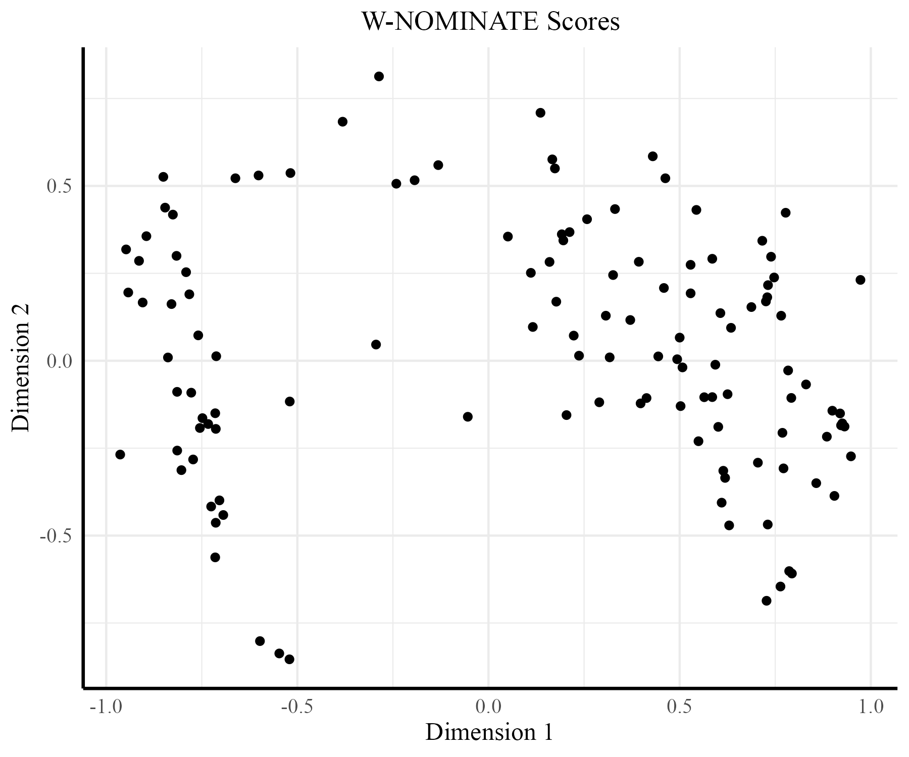
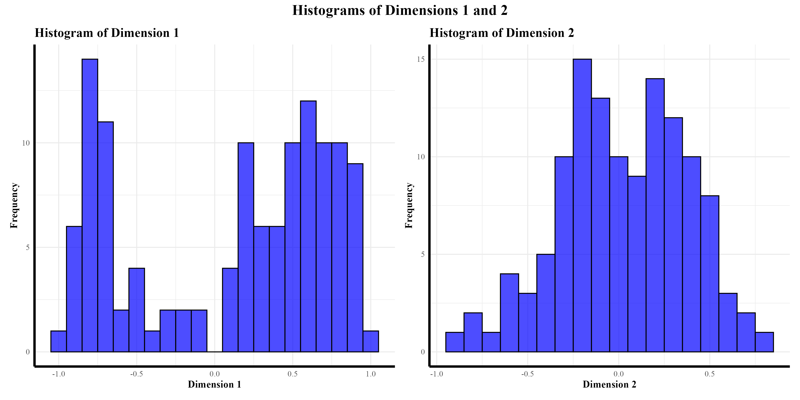
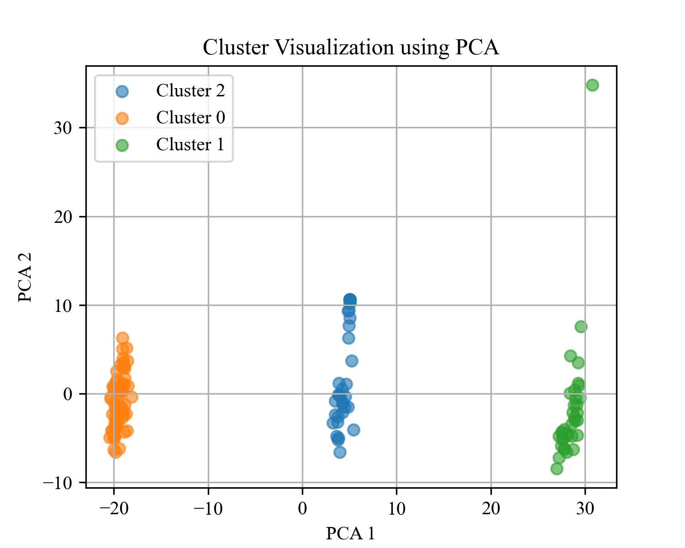
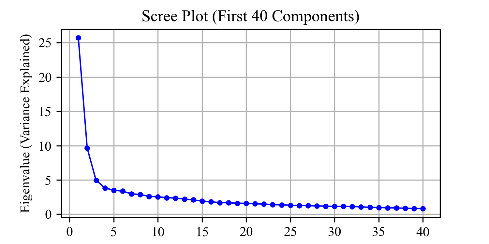

# Roll Call Vote Extraction and Analysis: Pennsylvania Constitutional Convention of 1968

This project examines voting behavior at the **Pennsylvania Constitutional Convention of 1968 (PCC68)** using text extraction, clustering, PCA, and **W-NOMINATE scaling**.  Although the convention was officially **non-partisan**, this analysis reveals underlying **patterns of partisanship** in delegate voting behavior.

---

## 🧠 Objective
The goal of this project is to extract, structure, and analyze roll call votes from the 1968 Pennsylvania Constitutional Convention.  
By applying quantitative scaling and clustering techniques, we can assess whether ideological or partisan divisions emerged in what was designed to be a nonpartisan deliberative body.

---

## 🧰 Tools & Methods
- **Python** – Text extraction, data cleaning, PCA, and preliminary visualization  
  - Libraries: `pandas`, `numpy`, `matplotlib`, `scikit-learn`
- **R** – W-NOMINATE scaling and visualization using **ggplot2**  
  - Libraries: `wnominate`, `ggplot2`, `dplyr`
- **Techniques:** Regex text parsing, PCA, clustering, and multidimensional scaling (W-NOMINATE)

---

## 📂 Data

### 🗃️ Data Sources
The roll call vote data were derived from archival records of the **Pennsylvania Constitutional Convention of 1968 (PCC68)**, which documented delegate votes on proposed constitutional provisions, amendments, and procedural motions.  
The records were transcribed from digitized text files originating from historical scans and converted into analyzable structured data.

---

### 🧾 Files
| File | Description |
|------|-------------|
| `V1.txt`, `V2.txt` | Raw text files containing roll call votes extracted from archival convention transcripts. Each line corresponds to a delegate’s recorded vote. |
| `rcv_extraction_and_analysis.ipynb` | Python notebook that parses, cleans, and structures the raw data into a vote-by-delegate matrix, followed by PCA and clustering analysis. |
| `wnominate.R` | R script implementing **W-NOMINATE** scaling and visualization using **ggplot2**. |
| `pcc68_roll_call_report.pdf` *(optional)* | Full written report detailing data sources, methodology, and findings. |

---

### 🧹 Data Processing & Coding Scheme
1. **Extraction:**  
   Used Python (regex and string parsing) to extract delegate names and corresponding votes from raw text sources.  

2. **Cleaning:**  
   Standardized delegate names, corrected OCR artifacts, and removed procedural or duplicated entries.  

3. **Coding Scheme:**  
   Each delegate’s vote was numerically encoded according to the following system:
   | Code | Meaning |
   |-------|----------|
   | `1` | Yea |
   | `0` | Did not vote |
   | `-1` | Nay |
   | `-99` | Absent |
   | `NA` | No data available |

4. **Transformation:**  
   Converted data into a wide-format matrix of **132 delegates** by **957 roll calls**, suitable for dimensional scaling and clustering analyses.

5. **Integration:**  
   - Python was used for initial cleaning, transformation, and exploratory PCA.  
   - The cleaned matrix was exported to R for W-NOMINATE analysis and visualization via **ggplot2**.

---

### 📈 Data Characteristics
- **Number of Delegates:** 132  
- **Number of Roll Call Votes:** 957  
- **Vote Coding:** 1 = Yea, 0 = Did not vote, -1 = Nay, -99 = Absent, NA = Missing  
- **File Format:** Wide-format CSV or matrix (delegates × roll calls)  
- **Total Entries:** 126,324 possible observations (132 × 957) before filtering

---

### ⚠️ Data Limitations
While every effort was made to ensure accuracy, several challenges inherent to historical data remain:

- **OCR Quality:**  
  The archival roll call lists were digitized from mid-20th-century scans with inconsistent text quality. As a result, some delegate names and vote markings required manual correction or could not be fully verified.

- **Name Ambiguity:**  
  Several delegates shared identical or nearly identical surnames or initials. Disambiguation was attempted through cross-referencing attendance lists, but some uncertainty persists, particularly for common surnames.

- **Vote Coding Inconsistencies:**  
  A small number of roll call records used slightly different vote indicators or cut points (e.g., procedural votes with “Yes/No/Present” distinctions). These were standardized as closely as possible, but residual variation may affect dimensional scaling results.

- **Missing or Unrecorded Votes:**  
  Some roll calls were incomplete or missing delegate data entirely, coded as `NA`. These were retained to preserve vote structure, though they slightly reduce precision in later scaling steps.

Despite these issues, the dataset remains robust enough to capture general ideological clustering and voting alignments within the convention.

---

### 🧾 Summary
This dataset provides a detailed, structured record of nearly **one thousand votes** cast by **132 delegates** during the **Pennsylvania Constitutional Convention of 1968**.  
It serves as a valuable foundation for exploring the emergence of **partisan voting behavior** in a body designed to operate under **nonpartisan principles**.

## 🗺️ Primary Visualization: NOMINATE Map

The **NOMINATE map** below visualizes delegates’ ideological positions based on their roll call votes at the convention.  
Each point represents a delegate positioned along two latent ideological dimensions derived from voting behavior. Although the convention was **nonpartisan by rule**, the clustering in the map suggests **de facto partisan alignment** among many delegates.

---

## 📊 Additional Visualizations

| Visualization | Description |
|----------------|-------------|
|  | Distribution scores accross two dimensions. The first is probably partisanship, and the second is likely ideology |
|  | Shows groupings of delegates with similar voting records |
|  | Variance explained by principal components |

---

## 🚀 Results
- Extracted and structured roll call data from the Pennsylvania Constitutional Convention of 1968.  
- Conducted PCA and W-NOMINATE scaling to identify ideological dimensions.  
- Despite the **nonpartisan structure** of the convention, the analysis revealed **distinct partisan clusters**, particularly on contentious procedural and institutional reform votes.  
- The **NOMINATE map** and cluster analysis both indicate that delegate alignments mirrored those of traditional party divisions in the broader Pennsylvania political system.

---

## 📚 Future Work
- Compare the PCC68 ideological structure with that of the Pennsylvania legislature during the same period.  
- Use NLP topic modeling to identify issue domains most associated with partisan divisions.  
- Explore historical records to contextualize individual delegates’ partisan backgrounds.

---

## 📬 Contact
**David Jackson**  
📧 [Adavidj59@gmail.com](mailto:Adavidj59@gmail.com)

